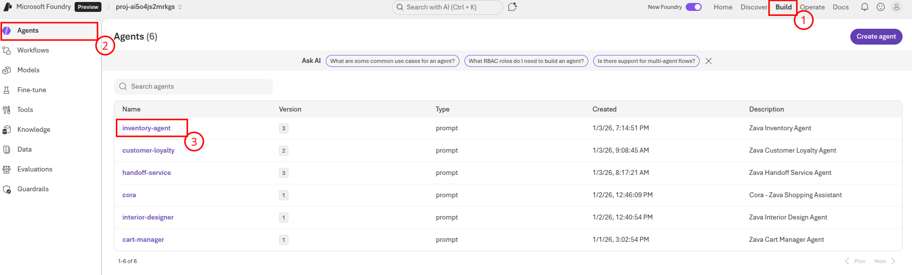
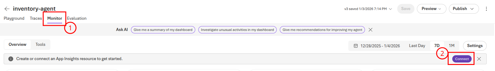
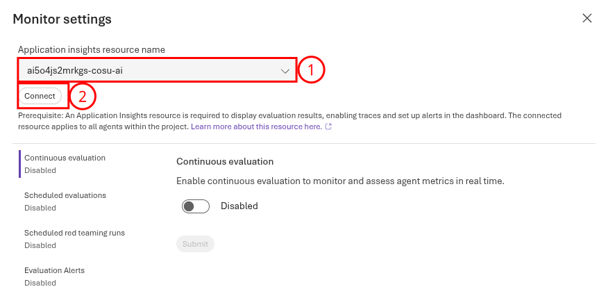
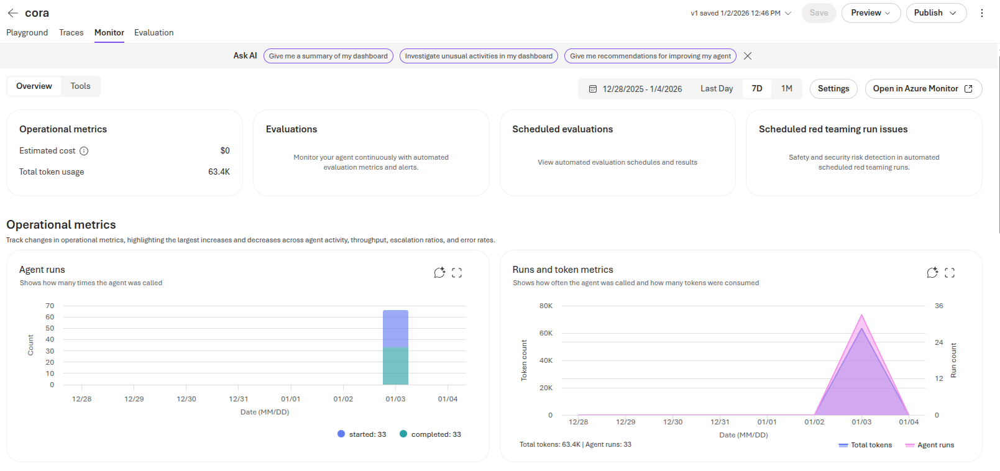
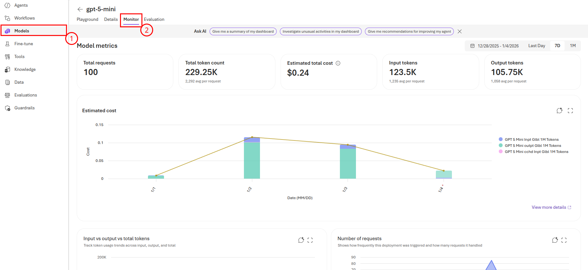

# Task 01 - Review the Microsoft Foundry agent monitor dashboard

## Introduction

Zava has an application up and running. They would like to monitor the performance and usage of their deployed AI agents to ensure they are functioning as expected and to identify any potential issues. To assist with this, Microsoft Foundry provides built-in observability features that allow you to track model and agent performance, usage metrics, and errors. In addition, Azure Monitor and Application Insights can be integrated with Microsoft Foundry to provide deeper insights into model behavior and application performance. This will help Zava ensure that their multimodal AI shopping assistant is reliable and performs well for their customers.

## Description

In this task, you will review the Microsoft Foundry Monitor dashboard to monitor the performance and usage of your deployed AI agents. You will explore the various metrics and visualizations available in the dashboard, which can help you understand how your models are being used and identify any potential issues.

## Success Criteria

- You have enabled monitoring capabilities in Microsoft Foundry.
- You have reviewed the Monitor dashboard for existing AI agents.

## Learning Resources

- [Observability in generative AI](https://learn.microsoft.com/azure/ai-foundry/concepts/observability)
- [Monitor your generative AI applications](https://learn.microsoft.com/azure/ai-foundry/how-to/monitor-applications)

## Key Tasks

### 01: Enable monitoring capabilities in Microsoft Foundry

To begin using the Monitor dashboard, you will first need to ensure that monitoring capabilities are enabled in your Microsoft Foundry project. This involves connecting an Application Insights resource to your Microsoft Foundry project.

<details markdown="block">
<summary><strong>Expand this section to view the solution</strong></summary>

First, navigate to [Microsoft Foundry](https://ai.azure.com) and select the AI project associated with this training. Then, select the **Build** menu from the top-right of the screen. Select the **Agents** tab and then choose the **inventory-agent** from the menu.



Choose the **Monitor** tab and then select the **Connect** button to connect Application Insights to this project.



After that, choose the name of your Application Insights resource and select **Connect** to make the connection.



This will connect the Application Insights resource for all agents. After connecting your Application Insights resource to the Microsoft Foundry project, you will be able to see a set of default metrics associated with your deployed models. These metrics include token utilization, latency, request counts, and error rates.

</details>

### 02: Instrument the client application

Some of the metrics available on the Monitor dashboard are based on telemetry data sent from your client application. To ensure that your application is properly instrumented, you will need to add the Application Insights SDK to your application code. The sample chat application already includes these instrumented capabilities. To verify that the application is properly instrumented, you can review the `chat_app.py` file in the `src` directory.

**Lines 20-21** of the `chat_app.py` file include the necessary import statements for the OpenTelemetry and Azure Monitor SDKs. Uncomment these lines, as well as **lines 66-67**. The `configure_azure_monitor()` function is called on **line 67**, which enables telemetry collection for the application.

```python
application_insights_connection_string = os.environ["APPLICATIONINSIGHTS_CONNECTION_STRING"]
configure_azure_monitor(connection_string=application_insights_connection_string)
```

You can also see the `configure_azure_monitor()` function call in two other files: `src/app/agents/agent_processor.py` and `src/app/tools/discountLogic.py`. This ensures that telemetry is collected for operations that occur within these files, so uncomment the relevant lines in these files as well: **line 25** in `src/app/agents/agent_processor.py` and **line 15** in `src/app/tools/discountLogic.py`.

### 03: Review default application metrics

Now that you have enabled monitoring capabilities in your Microsoft Foundry project and verified that your client application is properly instrumented, you can review the default application metrics available in the Monitor tab for each agent.

<details markdown="block">
<summary><strong>Expand this section to view solution</strong></summary>

First, return to [Microsoft Foundry](https://ai.azure.com) and select the AI project associated with this training. Then, select on the **Agents** tab, select one of the agents, such as the Cora agent. Open the **Monitor** tab and you will see a variety of metrics relate to your deployed models, including:

- Total number of tokens used
- Number of agent runs
- Number of tool calls
- Percentage of requests with errors



Additionally, you can view information at a model level by navigating to the **Models** tab and selecting one of your models, such as **gpt-5-mini**. From there, navigate to the **Monitor** tab and you can see model-level metrics. These metrics include:

- Total number of requests
- Total number of tokens used
- Estimated cost of token usage
- Numbers of input and output tokens
- Time to first byte in milliseconds
- Time to last byte in milliseconds

There are high-level totals at the top of the page, as well as breakdowns by day in charts on the page.



</details>
