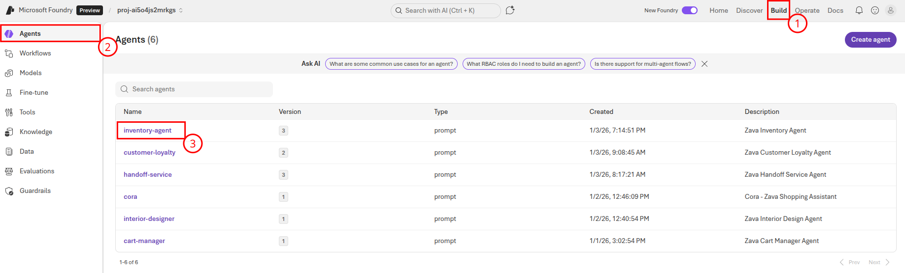
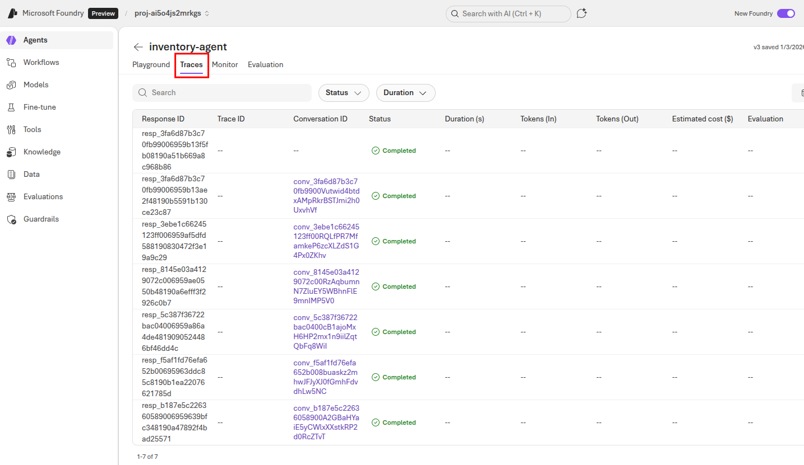
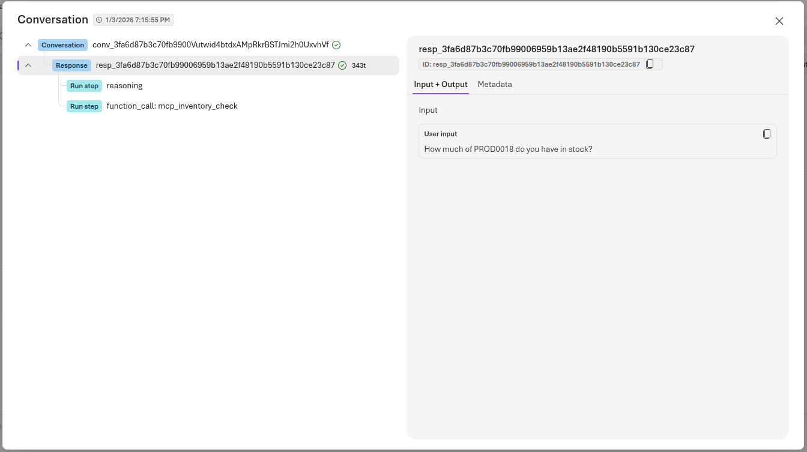
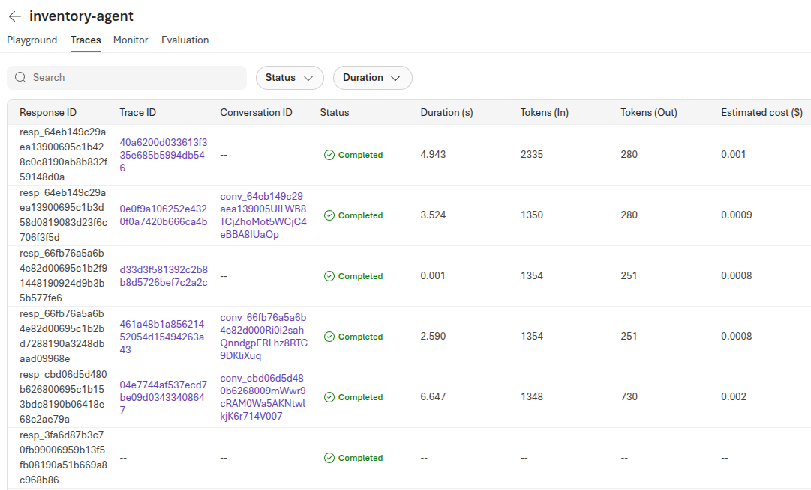
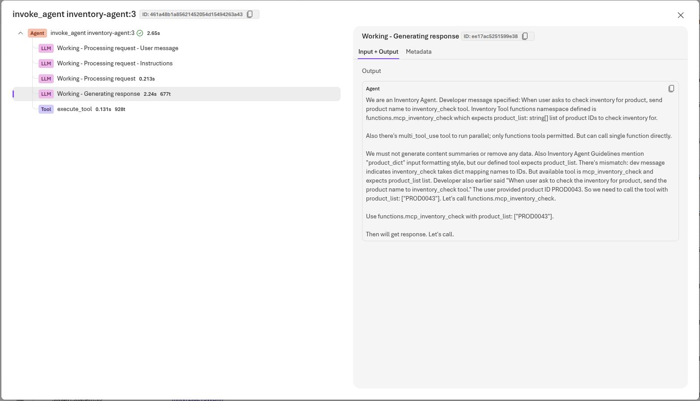

# Task 02 - Trace operations in Microsoft Foundry

## Introduction

In the prior task, you looked at some of the default monitoring capabilities available in Microsoft Foundry. However, the information that is captured by default is at an aggregate level and may not tell the entire story. To gain deeper insights into model behavior and application performance, you can instrument your client application with the OpenTelemetry SDK. This will allow you to capture detailed trace information, including the actual messages that were sent to the model and the responses that were received. This information can be invaluable for diagnosing issues and optimizing model performance.

## Description

In this task, you will trace operations in Microsoft Foundry by instrumenting your client application with the OpenTelemetry SDK. You will then generate some traffic to populate the Tracing dashboard for each agent with data. Finally, you will review the default application metrics available in the dashboard.

## Success Criteria

- You have added instrumentation logic to your client application.
- You have generated traffic to populate the Tracing dashboard for agents.

## Learning Resources

[View trace results for AI applications using OpenAI SDK](https://learn.microsoft.com/azure/ai-foundry/how-to/develop/trace-application)
[View trace results for AI agents in Microsoft Foundry](https://learn.microsoft.com/azure/ai-foundry/how-to/develop/trace-agents-sdk)

## Key Tasks

### 01: Review existing trace details

Before you add any additional logic to the client application, first review the information that is currently available within Microsoft Foundry's **Tracing** tab for agents.

<details markdown="block">
<summary><strong>Expand this section to view the solution</strong></summary>

First, navigate to [Microsoft Foundry](https://ai.azure.com) and select the AI project associated with this training. Then, select **Build** from the main menu. Choose **Agents** from the left-hand side and then select one of your agents, such as the **inventory-agent**.



From there, select the **Traces** tab to view instances in which the agent was called.



Select one of the conversations to view details on the trace.



In this example case, we spent 343 tokens to perform a lookup of stock quantities for the product whose ID is PROD0018. This agent performed a reasoning step and then needed to call the `mcp_inventory_check()` function to perform an inventory lookup. This trace is missing some relevant contextual information, such as the content of the response. This is because the client application has not been instrumented to capture this information.

</details>

### 02: Instrument the client application

As you saw in the first task, the **Traces** tab for agents in Microsoft Foundry contains some useful information about the operations that have occurred. However, it does not include any details about the responses that were received, or detailed information on duration, tokens, and estimated cost. To capture this information, you will need to add some instrumentation logic to your client application.

<details markdown="block">
<summary><strong>Expand this section to view the solution</strong></summary>

First, open the `src/chat_app.py` file in your code editor. Then, uncomment the following import statement on **line 14**.

```python
from opentelemetry.instrumentation.openai_v2 import OpenAIInstrumentor
```

On **line 67**, you will see a call to `configure_azure_monitor()`. This call enables telemetry collection and is why we see the information that we do in the **Tracing** menu. Immediately after this line (that is, on **line 68**), uncomment the following line of code to instrument OpenAI operations.

```python
OpenAIInstrumentor().instrument()
```

Repeat this process in two more files: `src/app/agents/agent_processor.py` and `src/app/tools/discountLogic.py`. For `agent_processor.py`, uncomment **lines 21 and 26**. For `discountLogic.py`, uncomment **lines 11 and 16**.

Once you have made your changes, save the files and restart the application by stopping the Uvicorn server (Ctrl+C) and running the following command again.

```bash
uvicorn chat_app:app --host 0.0.0.0 --port 8000
```

</details>

### 03: Populate with additional data

Once you have updated the client application with the necessary instrumentation logic, you will need to generate some traffic to populate the Application analytics dashboard with data. Navigate back to your deployed application and interact with it to generate requests. Sample prompts may include the following:

- "What are the latest trends in home decor?"
- "Can you help me find a sofa that fits my style?"
- "Do you have any blue paint in stock?"
- "How much of PROD0043 do you have in stock?"
- "What is the availability of the 'Modern Chair'?"
- "I am ready to check out."

Enter a variety of prompts to generate different types of requests.

### 04: Review new trace details

As you interact with the application, new trace operations will be captured and sent to Microsoft Foundry. Navigate back to the **Traces** menu in Microsoft Foundry for the inventory agent to review the new trace details. If you do not see any new trace operations, refresh the page.



New trace operations that come in may now populate the **Duration**, **Tokens (In)**, **Tokens (Out)** and **Estimated cost** columns in the grid. Furthermore, each trace has a Trace ID that you can select. This provides a detailed breakdown of what happened during a given conversation.

you can select a trace operation to view additional details, including the actual messages that were sent to the model and the responses that were received. This includes the system prompt and any user messages that were part of the conversation.



In the example above, this shows the output that the inventory agent emitted immediately before requesting invocation of the `mcp_inventory_check()` function for product code PROD0043.

### 05: Deploy to production

To conclude this task, you will deploy the latest version of the application to production. This will ensure that the instrumentation logic is included in the production environment and that you can continue to capture trace information for future requests.

<details markdown="block">
<summary><strong>Expand this section to view the solution</strong></summary>

In order to deploy the latest version of the application to production, first ensure that all files are saved. Then, in the terminal, navigate to the `src` directory of your project if you are not already there. Stop the Uvicorn server if it is still running by pressing `Ctrl+C`. Then, build the Docker image by running the following command:

```bash
docker build -t {YOUR_REGISTRY_NAME}.azurecr.io/chat-app:latest .
```

Next, log in to your Azure Container Registry service by running the following command:

```bash
az acr login -n {YOUR_REGISTRY_NAME}.azurecr.io
```

Finally, push the Docker image to your Azure Container Registry by running the following command:

```bash
docker push {YOUR_REGISTRY_NAME}.azurecr.io/chat-app:latest
```

Because you have already configured the Azure App Service to use this image and Continuous Deployment is set to **On**, the App Service will automatically pull the latest version of the image and restart the application. This will take several minutes and you may need to stop and start the application manually if it does not restart automatically. Once the application is running again, you can navigate to the URL of your App Service to access the chat application.

</details>

{: .note }
> This particular way of deploying an application is not ideal. It requires you to have direct access to the production environment, which is not always feasible or secure. A better approach would be to use a CI/CD pipeline that automatically deploys the latest version of the application whenever changes are made to the codebase. This would ensure that the production environment is always up-to-date with the latest code and would reduce the risk of human error during the deployment process. This will be the main focus of Exercise 05.
