# Task 03 - Monitoring and Evaluation in Microsoft Foundry

## Introduction

Over the prior two tasks in this exercise, you have reviewed the default monitoring capabilities available in Microsoft Foundry and instrumented your client application with the OpenTelemetry SDK to capture detailed trace information. This information can be valuable to Zava as they look to monitor the performance and usage of their deployed AI models. However, to track model quality and safety, we will need to create and schedule agent evaluations.

## Description

In this task, you will create a scheduled evaluation to gauge the quality and safety features of your AI agents. You will then observe the results in the Monitor tab for those agents.

## Success Criteria

- You have customized the Application Insights dashboard.
- You have set up alerts for specific metrics.
- You have created an evaluation for an existing agent.

## Learning Resources

- [Monitor Azure OpenAI](https://learn.microsoft.com/azure/ai-foundry/openai/how-to/monitor-openai)
- [Monitor your generative AI applications](https://learn.microsoft.com/azure/ai-foundry/how-to/monitor-applications)
- [Monitor Microsoft Foundry Agent Service](https://learn.microsoft.com/azure/ai-foundry/agents/how-to/metrics)

## Key Tasks

### 01: Create a new evaluation

Before you create custom monitoring metrics, it is a good idea to review one of the existing queries to understand how it works.

<details markdown="block">
<summary><strong>Expand this section to view the solution</strong></summary>

First, navigate to [Microsoft Foundry](https://ai.azure.com) and select the AI project associated with this training. Then, select **Build** from the main menu and **Evaluations** from the left-hand menu. From there, select **Create** to create a new evaluation.

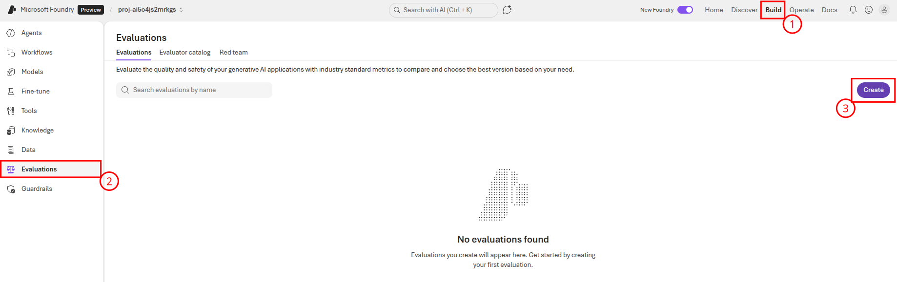

On the first page of the form, ensure that the **Agent** radio button is active. Then, select the **handoff-service** for evaluation. Finally, select **Next** to continue to the next page.

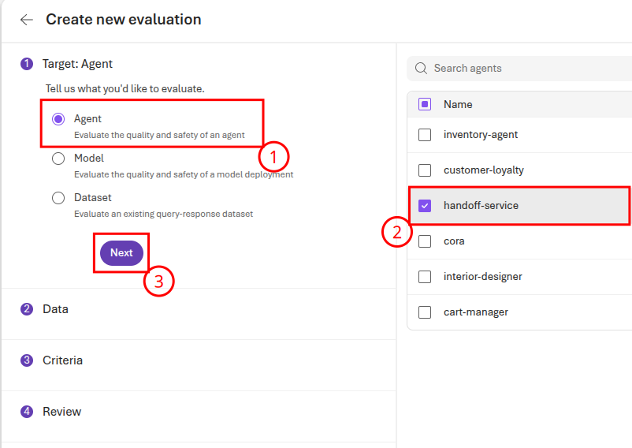

On the second page of the form, you will need to generate sample data. Ensure that the **Synthetic generation** radio button is active and then choose the **Generate** button. On the form, change the name to `handoff_service_evaluation` and enter the following text as the prompt:

```text
Please generate a series of prompts that an AI agent for a home improvement store would receive. This should include legitimate questions around current inventory, questions about items in a user's cart, recommendations and advice for interior design, questions about store hours, questions about return policies, and more. In addition, there should be some inappropriate prompts, such as asking for information on competitors, questions about philosophical and social issues, and irrelevant commentary.
```

Once you have entered this prompt, select **Confirm** to return to the form. Then, select **Next** to continue.


On the third page of the form, keep the set of evaluators as-is. Then, select **Next** to continue to the fourth page of the form, where you will review the evaluation. Rename the evaluation to `handoff-service-evaluation` then then select **Submit**.

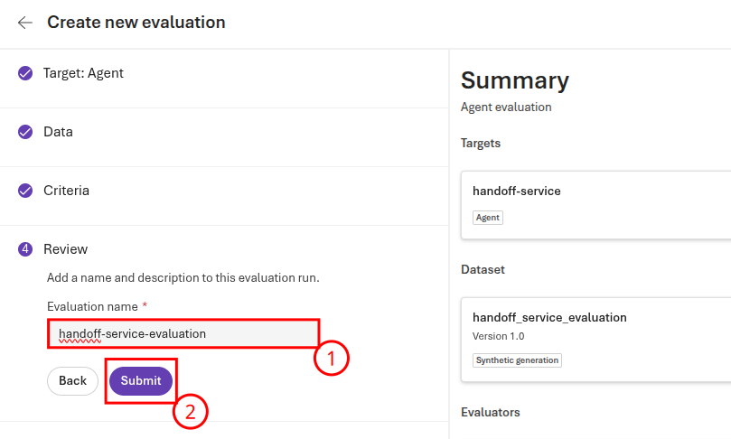

This will take several minutes to complete.

</details>

### 02: Review evaluation results

Now that you have run an evaluation, you can review the results in the Microsoft Foundry portal.

<details markdown="block">
<summary><strong>Expand this section to view the solution</strong></summary>

Return to the **Evaluations** page in Microsoft Foundry. Then, select the **handoff-service-evaluation** link.

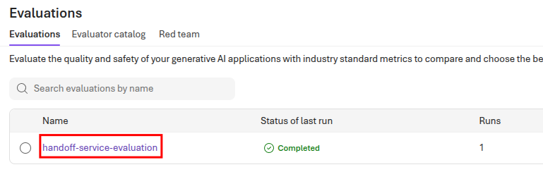

This will open the set of evaluations for the handoff service. Because you selected a variety of evaluators in the prior key task, you will likely need to scroll to the right to see results for each evaluator. When you have reviewed the overall results, select the **handoff-service** link to review the results specific to the handoff service.

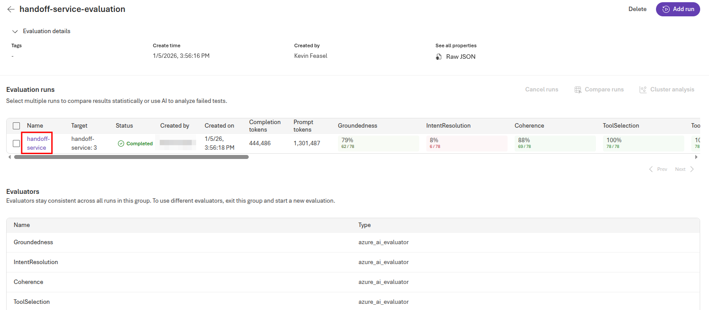

This populates a grid with detailed metrics for each test. You can mouse over the **query** column to see the incoming query, and then select the **View JSON** link for sample output to see what the handoff service returned.

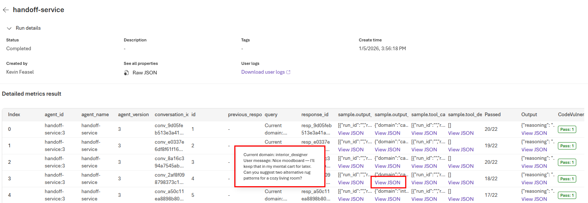

Selecting the **View JSON** link for **sample.output_text** provides the exact contents that the handoff service returns.

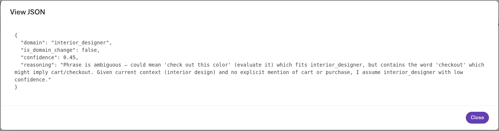

In this case, the handoff service admits the ambiguity of this prompt but ultimately decides on sending this to the interior designer agent because it does not directly pertain to the user's shopping cart.

Scrolling to the right, you can see the results for each test. Some of these, such as task adherence and task completion, may unnecessarily suffer because we did not describe exactly what the shape of the output should look like.

</details>

### 03: Defining proper results

The prior evaluation provided some interesting information, but certain parts of the evaluation were invalid because there was no clear picture of what a correct result should look like. In this key task, you will generate a new evaluation based on sample data with ground truth results.

<details markdown="block">
<summary><strong>Expand this section to view the solution</strong></summary>

Return to the **Agents** menu on the left-hand side and select the **handoff-service** agent. Then, navigate to the **Evaluation** tab and select the **Create** button.
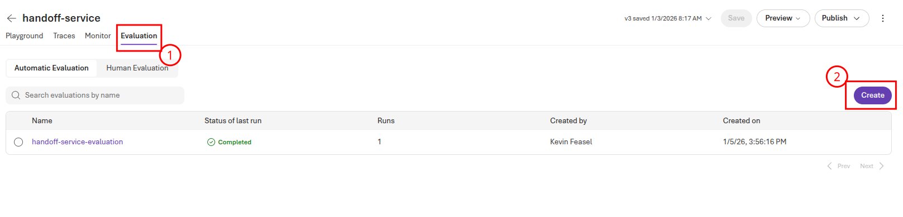

Select **Existing dataset** for the data source and then choose **Upload new dataset**. Name the dataset `handoff-service-grounded-data` and upload the file `src/data/handoff_service_evaluation_grounded.jsonl`. Select the **Upload** button to complete this upload.

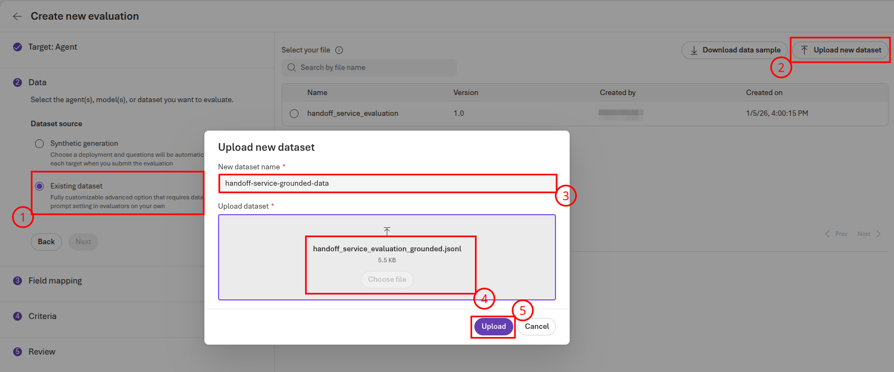

Select **Next** to continue to the **Field mapping** page. On this page, ensure that `{{item.expected_domain}}` is the selected value for **Ground truth** and then select **Next.**

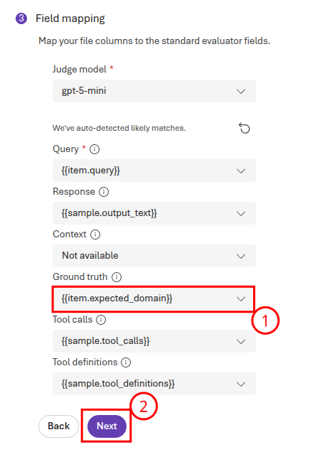

On the **Criteria** page, remove all of the default evaluators. Then, select **Add new evaluator** to add an evaluator. Choose the **Similarity-Evaluator** from the list.

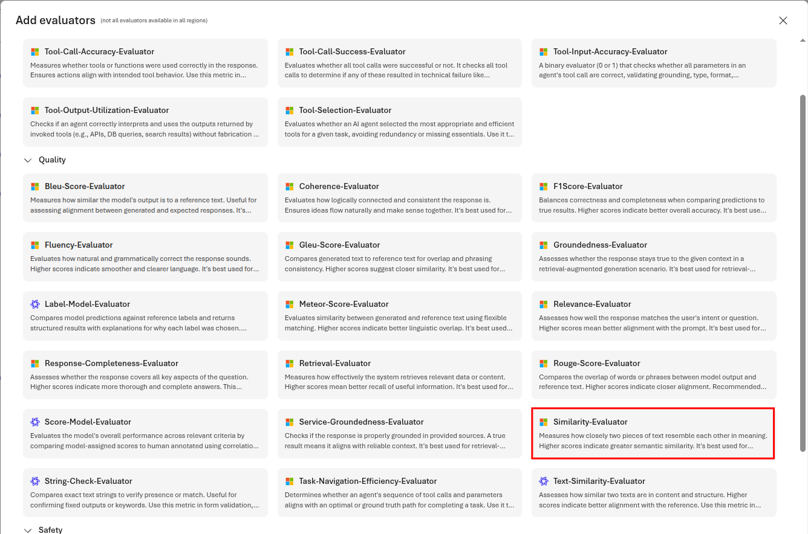

Ensure that the **Ground truth** is set to `{{item.expected_domain}}` and then select **Confirm** to continue.

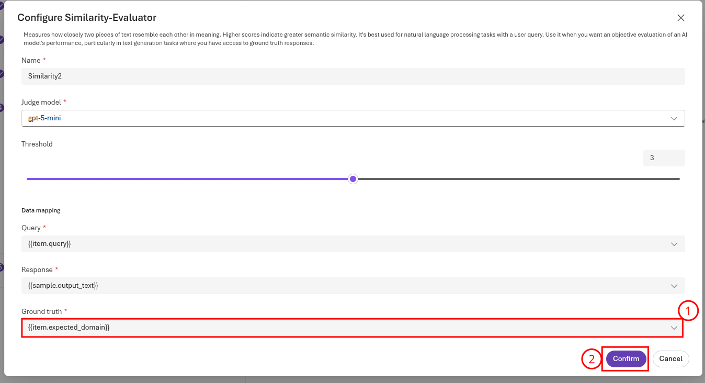

Then, select **Next** to continue. Name the evaluation `handoff-service-grounded` and then select **Submit** to complete the submission. This will, again, take several minutes to complete. Once it does, select the **handoff-service** evaluation run to view the results.

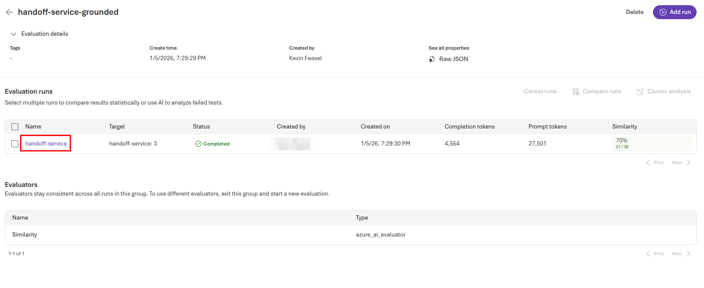

You can then review the similarity scores, comparing cases in which the domain switch was valid and invalid. Note that many of these examples are ambiguous, meaning that the expected similarity percentage will be under 100%. In the example above, the similarity score was 70%. It may be possible to use this information to modify the prompts and improve the quality of the handoff service.

</details>
