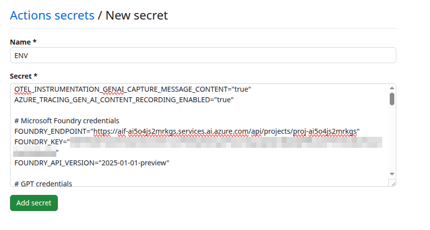

# Task 01 - Automate container deployment via GitHub Actions workflow

## Introduction

So far, you have manually deployed the chat application to an Azure App Service using a Docker container image stored in an Azure Container Registry. In this task, you will automate this deployment process using GitHub Actions and GitHub Copilot.

## Description

In this task, you will use GitHub Copilot to generate a GitHub Actions workflow that automates the deployment of the chat application to an Azure Container Registry. You will then set up the necessary GitHub secrets and perform the deployment using the generated workflow.

## Success Criteria

- You have created a GitHub Actions workflow that deploys the chat application to an Azure Container Registry.
- You have set up the necessary GitHub secrets for the deployment.
- You have successfully performed the deployment using the GitHub Actions workflow.

## Learning Resources

- [Writing workflows](https://docs.github.com/actions/how-tos/write-workflows)
- [Build images with Azure Container Registry](https://github.com/Azure/acr-build)
- [Using secrets in GitHub Actions](https://docs.github.com/actions/how-tos/write-workflows/choose-what-workflows-do/use-secrets)
- [Asking GitHub Copilot questions in GitHub](https://docs.github.com/copilot/how-tos/chat-with-copilot/chat-in-github)
- [Responsible use of GitHub Copilot Chat in GitHub](https://docs.github.com/copilot/responsible-use/chat-in-github)
- [How can I extract secrets using GitHub Actions?](https://stackoverflow.com/questions/59481933/how-can-i-extract-secrets-using-github-actions)

## Key Tasks

### 01: Chat with GitHub Copilot

Use GitHub Copilot to assist you in writing a GitHub Actions workflow that deploys the contents of the `src` folder to an Azure Container Registry. The Dockerfile is located in the `src` folder, and you need to include only the files in that folder for the Docker image. The workflow should be triggered on a push to the main branch. The workflow must also copy the contents of your local `.env` file to a new `.env` file inside the container, but you must **NOT** check in your .env file or make any secrets public. In the next step, you will set up GitHub secrets to handle this securely.

<details markdown="block">
<summary><strong>Expand this section to view the solution</strong></summary>

Navigate to your repository on GitHub where the code for this training is stored. This should be your forked repository and not the Microsoft repo. Select the GitHub Copilot icon at the top of the screen.


Ask the chat agent the following question:

```plaintext
I need to create a new GitHub Actions workflow to deploy the code in the src/ folder out to an Azure Container Registry. The Dockerfile is located in the src/ folder and I need to include only the files in that folder for the Docker image. The workflow should be triggered on a push to the main branch. I also need to copy the contents of a GitHub secret named ENV to a new .env file inside the container, but I must NOT check in my .env file or make any secrets public.
```

Review the response and make any necessary adjustments. Have the workflow run on each push to main and take the base secrets. You may need to **Allow** GitHub Copilot to access your repository if you have not done so already.


Accept the file and review the changes. Make sure there is an appropriate YAML file in the `.github/workflows` folder. You may need to make some adjustments to the file to ensure it meets your needs.

The output that GitHub Copilot generates should include the following key details:

1. Create a `.env` file from a GitHub Actions secret called `ENV`. It should write this to `src/.env` on the builder machine for subsequent deployment.
2. Log into Azure Container Registry. The easiest way to do this is via username and password, which you can store in GitHub Actions secrets.
3. Build and push the Docker container image to Azure Container Registry, with an image name of `chat-app`. Because your Azure App Service is tied in to the latest version of this container image, you do not need to push anything explicitly to the App Service from this GitHub Actions workflow.

{: .note }
> If there is a failure in the code generation process, you can still have it generate the file and you can commit it yourself.

</details>

If you are unable to get a satisfactory response from GitHub Copilot or wish to compare your results to a working example, you can use the following example workflow as a starting point. Make sure to adjust the values for your specific environment.

<details markdown="block">
<summary><strong>Expand this section to view the solution if you are not able to get a satisfactory response from GitHub Copilot</strong></summary>

A sample workflow is available in the `src/workflows/0501_deployment.yml` file. This YAML file can be copied to the `.github/workflows/` folder in your repository and it requires the following secrets to be set up in your GitHub repository:

- `AZURE_CONTAINER_REGISTRY`: The name of your Azure Container Registry.
- `AZURE_CONTAINER_REGISTRY_USERNAME`: The username for your Azure Container Registry.
- `AZURE_CONTAINER_REGISTRY_PASSWORD`: The password for your Azure Container Registry.
- `ENV`: The contents of your local .env file.

You will set up these secrets in the next step.

{: .note }
> You should create appropriate GitHub secrets based off of the GitHub Actions workflow file that Copilot generated for you. The secrets above are the ones that `src/workflows/0501_deployment.yml` uses, but you might use slightly different secrets or different names for these secrets.

</details>

### 02: Set up GitHub secrets

Now that you have a workflow file, you will need to create the necessary GitHub secrets to allow the workflow to authenticate to Azure and access your Azure Container Registry. Review the generated workflow file to determine which secrets are required and create them in the GitHub repository settings.

<details markdown="block">
<summary><strong>Expand this section to view the solution</strong></summary>

Navigate to the **Settings** tab of your repository on GitHub.


Then, select **Secrets and variables** from the left-hand menu, and then select **Actions**. Create new repository secrets by selecting the **New repository secret** button.


For each secret, enter the name into the **Name** field and the contents of the secret in the **Secret** field. Then, select **Add secret** to complete the process. You will not be able to see the contents of this secret after you have saved it, so double-check that you have the information correct.



</details>

### 03: Perform and verify the deployment

Once you have created the necessary secrets, you can perform the deployment by pushing a change to the main branch of your repository. This will trigger the GitHub Actions workflow and deploy the chat application to your Azure Container Registry. You can verify that the deployment was successful by checking the Actions tab in your GitHub repository and by checking your Azure Container Registry to see if the new image has been pushed.


