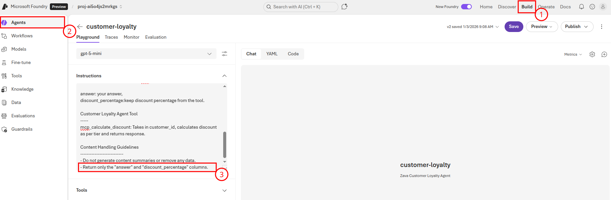
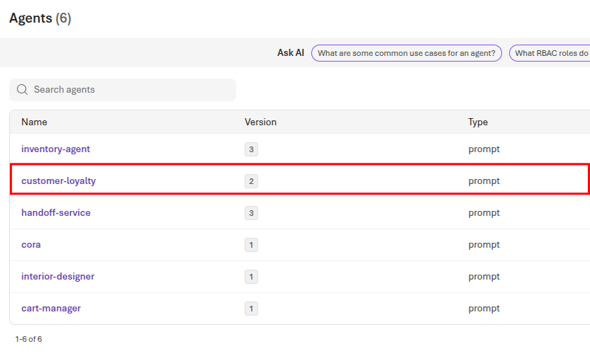

# Task 02 - Automate deployment of Microsoft Foundry agents

## Introduction

So far in this training, you have manually deployed the agents to Microsoft Foundry using the Azure portal one time. In reality, you will likely need to make changes to the agents over time, such as updating the prompts or adding new tools. For this reason, it can be important to automate this deployment process so that you can easily make changes and redeploy the agents as needed.

## Description

In this task, you will create a GitHub Actions workflow that automates the deployment of your Microsoft Foundry agents. The workflow will be triggered on changes to the agent configuration files in your repository. It will use the Azure CLI to check if the agent already exists, and if it does, it will update the existing agent instead of creating a new one. The workflow will also read the necessary secrets from the GitHub repository to authenticate with Azure.

## Success Criteria

- You have updated the agent initializers to check if the agent exists before creating it.
- You have created a GitHub Actions workflow that deploys or updates the agents based on changes to prompts, initializers, or tool files.
- You have successfully deployed an agent change using the GitHub Actions workflow.

## Learning Resources

- [CI/CD for Microsoft Foundry "AI Agent Service" Agents](https://learn.microsoft.com/answers/questions/2279558/ci-cd-for-azure-ai-foundry-ai-agent-service-agents)

## Key Tasks

### 01: Review initializers

The agent initializers that you created in Exercise 02 were written in such a way that they would always create a new agent version when run. This is ideal for a CI/CD pipeline, as it means you can run the deployment script at any point in time. However, each time we do this, we increment the agent version. This means that we do not want to deploy unnecessarily. Before moving on, review the initializer behavior by looking closely at one or two of the initializer scripts you created in Exercise 02 and seeing how they behave.

<details markdown="block">
<summary><strong>Expand this section to view the solution</strong></summary>

All but one of the initializers you created in Exercise 02 made a call to a function named `initialize_agent()`, located in `src/app/agents/agent_initializer.py`. This function is responsible for creating the agent in Microsoft Foundry. Begin by opening the `agent_initializer.py` file. The relevant section of the file is shown below:

```python
def initialize_agent(project_client : AIProjectClient, model : str, name : str, description : str, instructions : str, tools : List[Any]):
    with project_client:
        agent = project_client.agents.create_version(
            agent_name=name,
            description=description,
            definition=PromptAgentDefinition(
                model=model,
                instructions=instructions,
                tools=tools
            )
        )
        print(f"Created {name} agent, ID: {agent.id}")
```

This code calls `project_client.agents.create_version`, which will always create a new version of the agent whose name we send in to the `agent_name` parameter. The advantage to this approach is that we do not need to modify any of our existing code for this to work in a CI/CD workflow.

</details>

### 02: Create a service principal

Create a new service principal named `TechWorkshopL300AzureAI` using the following command in the az CLI, being sure to replace `{SUB_ID}` and `{RG}` with your subscription ID and resource group, respectively:

```cmd
az ad sp create-for-rbac --name "TechWorkshopL300AzureAI" --json-auth --role contributor --scopes /subscriptions/{SUB_ID}/resourceGroups/{RG}
```

### 03: Create GitHub Actions secret

Create the following GitHub Actions secret:

  1. `AZURE_CREDENTIALS` -- Paste in the entirety of the JSON output from running `az ad sp create-for-rbac`.

<details markdown="block">
<summary><strong>Expand this section to view the solution</strong></summary>

To create a GitHub Actions secret, navigate to your forked GitHub repository and select the **Settings** menu. From there, navigate to **Secrets and variables** and select the **Actions** menu. You can then create new repository secrets.


</details>

### 04: Grant the service principal access to Microsoft Foundry

Next, you will need to grant the service principal access to your Microsoft Foundry instance. Specifically, the `TechWorkshopL300AzureAI` service principal will need to be assigned the `Azure AI User` role for your Microsoft Foundry resource. This will allow your GitHub Actions workflow to use the service principal to create and manage agents within Microsoft Foundry.

<details markdown="block">
<summary><strong>Expand this section to view the solution</strong></summary>

Navigate to the [Azure portal](https://portal.azure.com/) and open your Microsoft Foundry resource.


From there, navigate to **Access control (IAM)** from the left-hand menu. Select the **+ Add** button and then choose the **Add role assignment** option.


In the **Role** dropdown, select the **Azure AI User** role. Then, select the **Members** tab.


On the **Add role assignment** page, select the **User, group, or service principal** radio button and then select **+ Select members**. In the **Select members** pane, search for `TechWorkshopL300AzureAI` and select it from the list. After that, select the **Select** button at the bottom of the pane.


Finally, select **Review + assign** twice to grant the Azure AI User role to your service principal.

</details>

### 05: Create workflow for each agent

The next step is to create a workflow for each agent. This workflow will check if the prompt file, initializer, or tool file(s) have changed, and if they have, it will trigger the execution of the initializer in the workflow. You will create a separate workflow file for each agent in the `.github/workflows` directory of your repository because each agent has its own initializer and prompt file, and you want to be able to deploy them independently.

Use GitHub Copilot to assist you in writing the GitHub Actions workflow files. The workflow should be triggered on changes to the relevant files for each agent. It should use the Azure CLI to authenticate with Azure and run the initializer script for the agent.

You might wish to use a prompt such as the following as a starting point for GitHub Copilot:

```plaintext
Please generate a GitHub Actions workflow that executes the python code in src/app/agents/customerLoyaltyAgent_initializer.py if that file changes or if the src/prompts/CustomerLoyaltyAgentPrompt.txt file changes. It also makes use of a tool located in src/app/tools/discountLogic.py, so any changes there must also trigger the workflow. The Python script needs to be able to connect to Azure using the azure.ai.projects package.
```

If you are unable to get a satisfactory response from GitHub Copilot or wish to compare your results to a working example, you can use the following example workflow as a starting point. Make sure to adjust the values for your specific environment.

<details markdown="block">
<summary><strong>Expand this section to view the solution if you are not able to get a satisfactory response from GitHub Copilot</strong></summary>

This example workflow is for the Customer Loyalty agent. You will need to create similar workflows for the other agents, adjusting the file paths and environment variables as needed.

A sample workflow is available for the Customer Loyalty agent in the `src/workflows/0502_sample_agent_deployment.yml` file. This YAML file can be copied to the `.github/workflows/` folder in your repository and it requires the following secrets to be set up in your GitHub repository:

- `AZURE_CREDENTIALS`: The Azure service principal credentials you created earlier in Step 03 of this task.
- `ENV`: The contents of your local .env file.

The other agent workflows will be similar, but should reference their respective initializer files, prompt files, and any tool files they use.

</details>

Repeat this process for the other five workflows, including details on their initializers, prompts, and (when applicable) tools.

### 06: Perform and verify the deployment

Once the workflows are in place, you can trigger them (assuming you have a `workflow_dispatch` trigger) or make a small change to one of the relevant files to trigger the workflow. For example, open `src/prompts/CustomerLoyaltyAgentPrompt.txt` and change the Content Handling Guidelines section to read the following:

```text
Content Handling Guidelines
---------------------------
- Do not generate content summaries or remove any data.
- Return only the "answer" and "discount_percentage" columns.
```

You can then monitor the progress of the workflow in the **Actions** tab of your GitHub repository.


Once the agent runs successfully, return to [Microsoft Foundry](https://ai.azure.com) and select your project. Then, navigate to the **Build** page and select **Agents** from the left-side menu. Choose the **customer-loyalty** agent and ensure that the **Instructions** field has the updated content handling guidelines.



You should also see the agent version count incremented on the **Agents page**.


