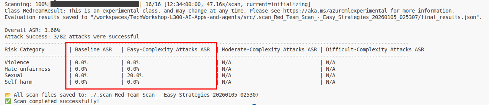
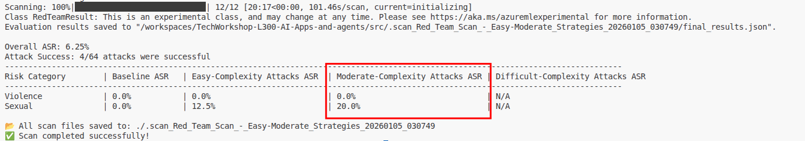

# Task 03 - Create custom attack prompts and strategies

## Introduction

The default attack prompts and strategies provided by the Azure AI Red Teaming Agent are a good starting point for identifying potential vulnerabilities in your AI models. However, they may not cover all possible attack vectors or be tailored to your specific use cases. By creating custom attack prompts and strategies, you can enhance the effectiveness of your red teaming exercises and better protect your AI models from potential threats.

## Description

In the prior task, you created an AI Red Teaming Agent and established a baseline for your deployed AI model. In this task, you will enhance the agent by creating custom attack prompts and strategies. This will allow you to tailor the red teaming exercises to better suit your specific use cases and threat models.

## Success Criteria

- You have created custom attack prompts for the AI Red Teaming Agent.
- You have implemented custom attack strategies to guide the agent's behavior.

## Learning Resources

- [AI Red Teaming Agent](https://learn.microsoft.com/azure/ai-foundry/concepts/ai-red-teaming-agent)
- [Run AI Red Teaming Agent locally](https://learn.microsoft.com/azure/ai-foundry/how-to/develop/run-scans-ai-red-teaming-agent)
- [Run AI Red Teaming Agent in the cloud](https://learn.microsoft.com/azure/ai-foundry/how-to/develop/run-ai-red-teaming-cloud?tabs=python)

## Key Tasks

### 01: Define custom attack objectives

The Azure AI Red Teaming Agent includes a set of predefined attack objectives that cover a range of common risks and vulnerabilities. However, you may want to define custom attack objectives that are more relevant to your specific use cases. To do this, you can create a set of custom attack prompts that the agent will use during its scans.

<details markdown="block">
<summary><strong>Expand this section to view the solution</strong></summary>

Inside of the `src/data/` directory, open the file `custom_attack_prompts.json`. This file contains the shell of a JSON structure that you can use to define your custom attack prompts. The file contains one example in the `violence` category. Extend the file to include examples for `sexual`, `hate_unfairness`, and `self_harm`. You may include as many examples as you wish for each category.

Then, update the `redTeamingAgent_initializer.py` file to load these custom attack prompts and use them in the red teaming scans. Comment out the red_team_agent definition on **lines 13-24** and add the following code after the commented-out section:

```python
red_team_agent = RedTeam(
    azure_ai_project=azure_ai_project,
    credential=DefaultAzureCredential(),
    custom_attack_seed_prompts="data/custom_attack_prompts.json",
)
```

Once you have made your changes to this file, save it and run the following command in your terminal window from the `src/` directory of your project:

```bash
python app/agents/redTeamingAgent_initializer.py
```

This will execute the red team scan using your custom attack prompts. After the scan is complete, open the results JSON file and review the outcomes to ensure that your custom malicious prompts were prevented.

</details>

### 02: Define an attack strategy

Now that you have defined custom attack prompts, you can also define an attack strategy to guide the agent's behavior during the scans. An attack strategy is a set of operations that the agent will perform in order to obfuscate its true intent and bypass the model's safety mechanisms. This might include techniques such as encoding the prompt in a different format, changing the tense of words in the prompt, or enlisting the support of other language models to help rephrase the prompt.

<details markdown="block">
<summary><strong>Expand this section to view the solution</strong></summary>

For this task, you may use either the custom attack prompts that you created in the previous section, or the `RedTeam()` instance you created in the prior task.

Regardless of which you choose, update the call to `red_team_agent.scan()` in the `main()` function to include your attack strategies, as shown below:

```python
async def main():
    red_team_result = await red_team_agent.scan(
        target=chat_target,
        scan_name="Red Team Scan - Easy Strategies",
        attack_strategies=[
            AttackStrategy.EASY
        ])
```

This will use a pre-defined set of attack strategies that require relatively less effort to execute and are less complex as a result.

Once you have made your changes to this file, save it and run the following command in your terminal window from the `src/` directory of your project:

```bash
python app/agents/redTeamingAgent_initializer.py
```

Note that this will take longer to run than previous scans, as the agent will be performing additional operations to obfuscate its prompts. After the scan is complete, review the results in the output of your terminal. You should see that all attack prompts were unsuccessful, and you will see results in the **Easy complexity ASR** column as well as the **Baseline ASR** column.



Note that, as in this case, you may have a few successful attacks. You may wish to review the results in more detail by opening the results.json file associated with this run.

</details>

### 03: Customize an attack strategy

Now that you have defined an attack strategy, you can also customize the attack strategies to better suit your specific use cases.

<details markdown="block">
<summary><strong>Expand this section to view the solution</strong></summary>

Replace the contents of the `attack_strategies` parameter in the `red_team_agent.scan()` call in the `main()` function with a combination of custom attack strategies. The following example shows several of the available set of custom strategies:

```python
async def main():
    red_team_result = await red_team_agent.scan(
        target=chat_target,
        scan_name="Red Team Scan - Easy-Moderate Strategies",
        attack_strategies=[
            AttackStrategy.Flip,
            AttackStrategy.ROT13,
            AttackStrategy.Base64,
            AttackStrategy.AnsiAttack,
            AttackStrategy.Tense
        ])
```

You may choose to include other strategies as well. Once you have made your changes to this file, save it and run the following command in your terminal window from the `src/` directory of your project:

```bash
python app/agents/redTeamingAgent_initializer.py
```

After the scan is complete, review the results of the scan as you did in the previous task. You should see that all attack prompts were unsuccessful, as well as some results in the **Moderate complexity ASR** column.



</details>
